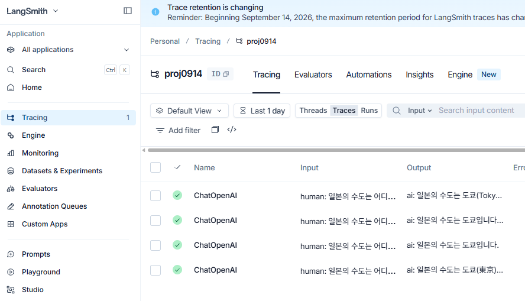

# 랭스미스 사용법

```python
from langchain_openai import ChatOpenAI 

llm = ChatOpenAI(model="gpt-4o-mini")
question = "일본의 수도는 어디인가요?"
response = llm.invoke(question)
print(response.content)
```

출력:

```txt
일본의 수도는 도쿄(Tokyo)입니다. 도쿄는 일본의 정치, 경제, 문화의 중심지로 알려져 있습니다.
```

랭체인이랑 코드는 같지만 다음과 같은 이미지처럼 langsmith 사이트에 기록이 저장된다.




# 에이전트(Agent)와 Tool 사용법

다음과 같이 임포트 해야함

```python
from langchain_core.tools import tool
from langchain.agents import create_agent
```

`@tool` 데코레이터를 붙이면 함수를 에이전트가 쓸 수 있는 Tool로 만들 수 있다. 이때 함수의 docstring이 그대로 Tool 설명으로 쓰이기 때문에 꼭 작성해야 한다.

```python
# 1. Tool 정의
@tool
def get_weather(city: str) -> str:
    """Get weather for a given city."""
    return f"It's always sunny in {city}!"

llm = ChatOpenAI(model="gpt-4o-mini", temperature=0)
agent = create_agent(model=llm, tools=[get_weather])

result = agent.invoke({"messages": [("user", "San Francisco 날씨 어때?")]})
print(result["messages"][-1].content)
```

출력:

```txt
샌프란시스코의 날씨는 항상 맑습니다!
```

`create_agent(model=llm, tools=[...])`로 모델과 사용할 Tool 목록을 넣어서 에이전트를 만든다. `agent.invoke({"messages": [("user", 질문)]})` 형태로 질문을 보내면, 에이전트가 스스로 판단해서 필요할 때 정의해둔 Tool(get_weather)을 호출한 뒤 답을 만든다. 결과는 메시지 리스트로 오기 때문에 `result["messages"][-1].content`로 마지막 메시지 내용만 꺼내서 확인하면 된다.

# langchain_teddynote로 랭스미스 추적 켜고 끄기

`.env`에 LangSmith 관련 환경변수를 넣어두는 방식 말고, `langchain_teddynote` 패키지를 쓰면 코드 한 줄로 추적을 켜고 끌 수 있다.

```cmd
pip install langchain_teddynote
```

```python
from langchain_teddynote import logging

# 랭스미스 추적 시작
logging.langsmith("proj0914", set_enable=True)
```

출력:

```txt
LangSmith 추적을 시작합니다.
[프로젝트명]
proj0914
```

추적을 끄고 싶으면 `set_enable=False`로 호출하면 된다.

```python
logging.langsmith("proj0914", set_enable=False)
```